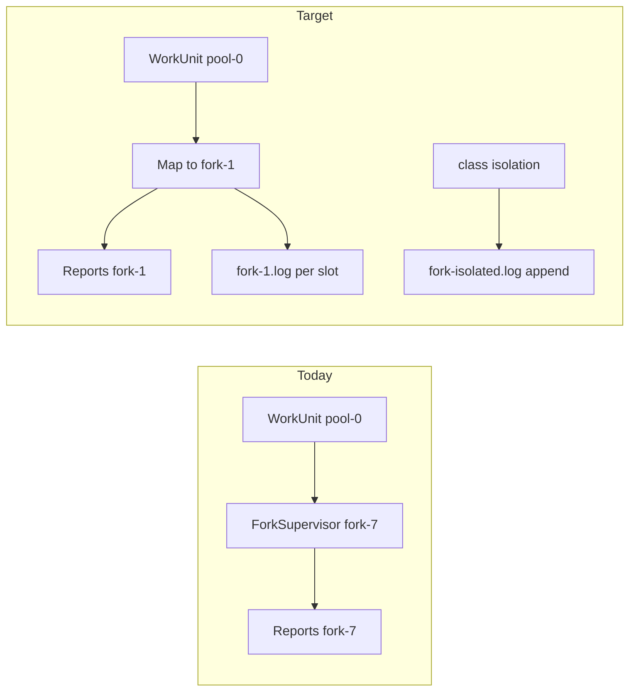

# Semantic fork IDs in reportage

Replace the global monotonic `fork-N` counter in reports and human-facing output with semantic fork IDs: **`fork-1` / `fork-2`** for shared-pool slots, **`fork-fresh`** for `FRESH_FORK`, **`fork-isolated`** for `ONE_FORK_PER_CLASS`.

**Log files:** one file per shared-pool slot (`fork-1.log`, `fork-2.log`); **aggregated** logs for escalated isolation (`fork-fresh.log`, `fork-isolated.log`) so a busy run does not create thousands of per-JVM files. IPC still uses a unique internal process id per launch (not one file per id).

## Problem today

[`ForkSupervisor`](../phoenixfire-core/src/main/java/io/phoenixfire/core/supervisor/ForkSupervisor.java) assigns every JVM a global id via `forkCounter` (`fork-1`, `fork-2`, …, plus `discover-N`). That id flows into attempts, JSONL, retry summary, and `forks/<id>.log`.

Isolation strategies already plan meaningful **work unit** ids ([`pool-0`](../phoenixfire-core/src/main/java/io/phoenixfire/core/isolation/SharedForkPoolStrategy.java), [`fresh-0`](../phoenixfire-core/src/main/java/io/phoenixfire/core/isolation/FreshForkStrategy.java), [`class-0-…`](../phoenixfire-core/src/main/java/io/phoenixfire/core/isolation/OneForkPerClassStrategy.java)), but those never reach reports—only the global counter does.



## Naming rules

| Isolation level | Report / human-facing `fork` | Rationale |
|-----------------|------------------------------|-----------|
| `SHARED_FORK_POOL` | `fork-1`, `fork-2`, … (1-based slot) | Parallel pool slots; co-tenancy matters |
| `FRESH_FORK` | `fork-fresh` | Single clean JVM batch (not enumerated) |
| `ONE_FORK_PER_CLASS` | `fork-isolated` | No slot index; class is already identified by test |
| Discovery | `discover-1` (unchanged) | Not execution reportage |

**Must `fork` always be numeric?** No. `forkId` in reports is semantic. **IPC registration** still needs a unique id per JVM launch (e.g. internal `proc-<uuid>`); that id is not exposed in JSON reportage.

## Fork log files (`target/phoenixfire-reports/forks/`)

Avoid one log file per isolated JVM when many classes escalate.

| Isolation | Log file(s) | Behaviour |
|-----------|-------------|-----------|
| `SHARED_FORK_POOL` | `fork-1.log`, `fork-2.log`, … | One file per pool **slot** (matches report `fork-1`). Retries on the same slot **append** to the same file with a session banner (no `fork-1-r2.log` proliferation). |
| `FRESH_FORK` | `fork-fresh.log` | **Single aggregated file** for the run; each fresh JVM appends (escalated batches are run serially today). |
| `ONE_FORK_PER_CLASS` | `fork-isolated.log` | **Single aggregated file** for the run; each per-class JVM appends. |
| Discovery | `discover-1.log`, … | Unchanged (short-lived, not execution reportage). |

**Session banners** (written by supervisor before each append) make aggregated logs grep-friendly:

```text
===== phoenixfire fork-isolated 2026-06-02T12:34:56Z process=proc-a1b2 workUnit=class-0-com.example.Foo tests=12 =====
... merged stdout/stderr ...
```

**Why append is safe for isolated:** [`ExecutionEngine.runLevel`](../phoenixfire-core/src/main/java/io/phoenixfire/core/engine/ExecutionEngine.java) runs non–shared-pool work units **serially** (`for (WorkUnit unit : units)`). Shared pool alone runs in parallel and therefore keeps **separate** slot files.

**Failure diagnostics:** `ForkSupervisor` tail-on-failure reads from the **aggregated** path for that tier (or the last appended segment). Optional JSONL field `forkLog` could point to `forks/fork-isolated.log` + line hint later; not required for v1.

**Argfiles:** stay per launch (`<processId>.args` next to logs dir) — classpath argfiles are not aggregated.

## Recommended design

### 1. Derive report fork id in one place

Add a small mapper used when building attempts in [`ExecutionEngine.processResult`](../phoenixfire-core/src/main/java/io/phoenixfire/core/engine/ExecutionEngine.java):

```java
// Conceptual
static String reportForkId(WorkUnit unit) {
  return switch (unit.isolationLevel()) {
    case SHARED_FORK_POOL -> "fork-" + poolIndex(unit.id()); // pool-0 -> fork-1
    case FRESH_FORK -> "fork-fresh";
    case ONE_FORK_PER_CLASS -> "fork-isolated";
  };
}
```

`poolIndex` parses `pool-(\d+)` from work unit id and adds 1 for 1-based `fork-1`, `fork-2`.

Pass **report fork id** into `ExecutionAttempt.forkId()` and reports.

### 2. Three ids, two surfaces

| Id | Purpose | Example |
|----|---------|---------|
| `reportForkId` | JSONL, retry summary, human output | `fork-1`, `fork-isolated` |
| `processForkId` | IPC register / HELLO / `PROP_FORK_ID` | `proc-7f3a…` (unique every launch) |
| `logFile` | Resolved path from isolation + slot | `forks/fork-1.log` or `forks/fork-isolated.log` |

Add `ForkLogPaths.resolve(IsolationLevel, reportForkId, forkLogDir)` (name TBD):

- `SHARED_FORK_POOL` → `forkLogDir.resolve(reportForkId + ".log")` (truncate-or-append per policy above)
- `FRESH_FORK` → `forkLogDir.resolve("fork-fresh.log")`
- `ONE_FORK_PER_CLASS` → `forkLogDir.resolve("fork-isolated.log")`

[`ForkLauncher`](../phoenixfire-core/src/main/java/io/phoenixfire/core/supervisor/ForkLauncher.java): use `ProcessBuilder.Redirect.appendTo(logFile)` when the target is an aggregated tier file and the file already exists; otherwise `to(logFile)`. Write session banner in supervisor immediately before start.

Discovery keeps `discover-N` process id + `discover-N.log` (unchanged).

Reports stay stable across shared-pool retries (`fork-1` on both attempts in [`shared-resume` IT](../phoenixfire-it/src/it/shared-resume/verify.groovy)); log evidence accumulates in `fork-1.log`.

### 3. Reporting and console

| Surface | Change |
|---------|--------|
| [`JsonLinesReportWriter`](../phoenixfire-core/src/main/java/io/phoenixfire/core/report/JsonLinesReportWriter.java) `fork` | Semantic values |
| [`NativeJsonReportWriter`](../phoenixfire-core/src/main/java/io/phoenixfire/core/report/NativeJsonReportWriter.java) `forkId` | Same |
| [`ExecutionEngine.logRetrySummary`](../phoenixfire-core/src/main/java/io/phoenixfire/core/engine/ExecutionEngine.java) | Shows `fork-1` / `fork-isolated` instead of `fork-7` |
| README “Reports” section | Document allowed `fork` values |

`forkReuse` boolean stays as-is (true only for `SHARED_FORK_POOL`).

### 4. Downstream metrics

[`BenchmarkAggregator`](../../../phoenixfire-chaos-corpus/chaos-benchmark/src/main/java/io/phoenixfire/chaos/benchmark/BenchmarkAggregator.java) `distinctForks`:

- Count only shared-pool attempts (or `fork` matching `fork-\d+`) so `fork-isolated` / `fork-fresh` do not inflate parallel-fork counts.
- Optional CSV rename to `distinctPoolForks` (document if kept as `distinctForks` with new semantics).

### 5. FRESH_FORK vs isolated

`fork-fresh` vs `fork-isolated` distinguishes “clean JVM batch” from “per-class isolation”. Both are non-enumerated; change is a one-line mapper if we collapse them.

## Non-goals

- Per-class fork numbers (`fork-isolated-2`) or per-class log files — test key + session banner are enough.
- Changing `forkCount` config semantics (still Maven parallel pool width).
- Exposing internal `processForkId` in reports.
- Parallel isolated forks (would require synchronized append or per-session temps); not supported today.

## Implementation checklist

- [ ] Add `reportForkId(WorkUnit)` mapper (`pool-0`→`fork-1`, FRESH→`fork-fresh`, CLASS→`fork-isolated`)
- [ ] Add `ForkLogPaths` (or equivalent): slot logs vs aggregated `fork-fresh.log` / `fork-isolated.log`
- [ ] `ForkSupervisor` + `ForkLauncher`: unique `processForkId` for IPC; resolve log path by isolation; append + session banner for aggregated/shared retry
- [ ] `ExecutionEngine.processResult`: store `reportForkId` on `ExecutionAttempt`
- [ ] Update JsonLines/Native writers, retry summary, README (`forks/` layout); adjust `BenchmarkAggregator` `distinctForks`
- [ ] Unit tests for mapping + collision; update aggregator/engine tests
- [ ] (Optional) IT `shared-resume`: assert both attempts report `fork: "fork-1"`

## Example retry summary (after)

```
  RECOVERED  com.example.FlakyTest#m()
      attempt 1   SHARED_FORK_POOL     CRASHED              fork-1
      attempt 2   SHARED_FORK_POOL     PASSED               fork-1
```

Escalated class isolation:

```
      attempt 3   ONE_FORK_PER_CLASS   PASSED               fork-isolated
```
